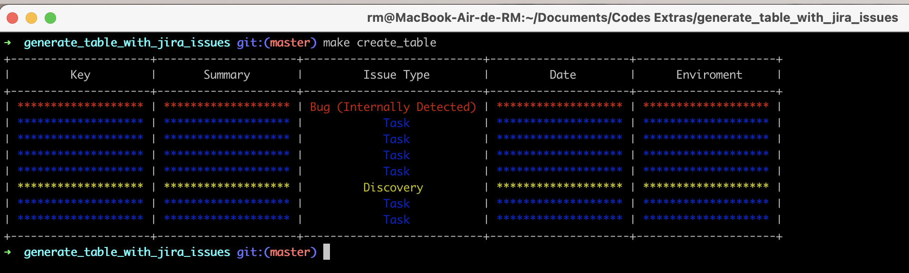

# Generate Table with Jira Issues

This project is about generate a table with Jira issues from loaded sprint.

Has been created using [Python 3.9.7](https://www.python.org/downloads/release/python-397/) and [Docker](https://docs.docker.com/).

## Instructions:
1. To build this image, use this Makefile command
```bash
$ make build
```

2. To run container, use this Makefile command
```bash
$ make run
```

## How to use:
1. Firstly, you need a download your JIRA file in CSV format. You will have to open the Sprint Report in Jira, in this url `{YOUR BOARD URL}/reports/sprint-retrospective`.
2. It will open in the last completed sprint. You should find a "View in Issue Navigator" link. Click on it.
3. You need to click in Export button, and after, click in "Export Excel CSV" (any of the options).
4. Move the downloaded file to [data_files](./data_files) folder.
5. Run the Makefile command `make create_json`. It will create the SPRINT.json file.

**ATTENTION: You will have to update the Date and Environment fields manually**.

6. After this, run the Makefile command `make create_table` and your table is show. DONE!



Created by: [Rodrigo Maria Morgão](mailto:rodrigo@rodrigomaria.com.br).